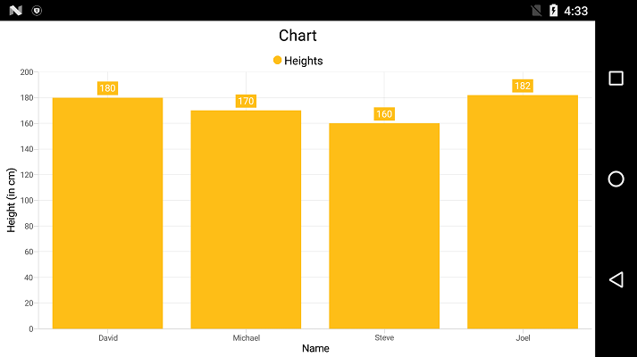

# Getting Started of Xamarin.Android Chart(SfChart)

This is demo application of Xamarin.Android SfChart control. The minimal set of required properties have been configured in this project to get started with SfChart in Xamarin.Android.

For more details please refer the Xamarin.Android SfChart UG documentation [Getting Started](https://help.syncfusion.com/xamarin-android/sfchart/getting-started) link.

## Initialize Chart

You can add [`SfChart`](https://help.syncfusion.com/cr/cref_files/xamarin-android/Syncfusion.SfChart.Android~Com.Syncfusion.Charts.SfChart.html) to the Xamarin.Android designer from toolbox and customize some basic properties from the property window.

You can get the chart instance from axml page in MainActivity using the following code.

**[C#]**
```
SfChart chart = FindViewById<SfChart>(Resource.Id.sfChart1);
```

You can create chart using code behind also. The following steps help to add chart using code behind.

Import the [`SfChart`](https://help.syncfusion.com/cr/cref_files/xamarin-android/Syncfusion.SfChart.Android~Com.Syncfusion.Charts.SfChart.html) namespace as shown below in your respective Page,

```
using Com.Syncfusion.Charts;

```
Then initialize an empty chart with [`PrimaryAxis`](https://help.syncfusion.com/cr/cref_files/xamarin-android/Syncfusion.SfChart.Android~Com.Syncfusion.Charts.ChartBase~PrimaryAxis.html) and [`SecondaryAxis`](https://help.syncfusion.com/cr/cref_files/xamarin-android/Syncfusion.SfChart.Android~Com.Syncfusion.Charts.ChartBase~SecondaryAxis.html) as shown below,

```
SfChart chart = new SfChart (this);

//Initializing Primary Axis
CategoryAxis primaryAxis = new CategoryAxis ();

chart.PrimaryAxis = primaryAxis;

//Initializing Secondary Axis
NumericalAxis secondaryAxis = new NumericalAxis ();

chart.SecondaryAxis = secondaryAxis;

SetContentView(chart);

```
Run the project and check if you get following output to make sure you have configured your project properly to add [`SfChart`.](https://help.syncfusion.com/cr/cref_files/xamarin-android/Syncfusion.SfChart.Android~Com.Syncfusion.Charts.SfChart.html)

## Populate Chart with data

To visualize the comparison of person heights in chart data, create an instance of [`ColumnSeries`](https://help.syncfusion.com/cr/cref_files/xamarin-android/Syncfusion.SfChart.Android~Com.Syncfusion.Charts.ColumnSeries.html), add it to the [`Series`](https://help.syncfusion.com/cr/cref_files/xamarin-android/Syncfusion.SfChart.Android~Com.Syncfusion.Charts.ChartBase~Series.html) collection property of [`SfChart`](https://help.syncfusion.com/cr/cref_files/xamarin-android/Syncfusion.SfChart.Android~Com.Syncfusion.Charts.SfChart.html), and then set the actual `Data` collection to the [`ItemsSource`](https://help.syncfusion.com/cr/cref_files/xamarin-android/Syncfusion.SfChart.Android~Com.Syncfusion.Charts.ChartSeries~ItemsSource.html) property of [`ChartSeries`](https://help.syncfusion.com/cr/cref_files/xamarin-android/Syncfusion.SfChart.Android~Com.Syncfusion.Charts.ChartSeries.html) as demonstrated in the following code snippet.

> You need to get the `Name` and `Height` values in `Data` collection to the [`ColumnSeries`](https://help.syncfusion.com/cr/cref_files/xamarin-android/Syncfusion.SfChart.Android~Com.Syncfusion.Charts.ColumnSeries.html) by setting [`XBindingPath`](https://help.syncfusion.com/cr/cref_files/xamarin-android/Syncfusion.SfChart.Android~Com.Syncfusion.Charts.ChartSeries~XBindingPath.html) and [`YBindingPath`](https://help.syncfusion.com/cr/cref_files/xamarin-android/Syncfusion.SfChart.Android~Com.Syncfusion.Charts.XyDataSeries~YBindingPath.html) with the respective field names to plot the series. 

```
//Initializing primary axis
CategoryAxis primaryAxis = new CategoryAxis();

primaryAxis.Title.Text = "Name";

chart.PrimaryAxis = primaryAxis;

//Initializing secondary Axis
NumericalAxis secondaryAxis = new NumericalAxis();

secondaryAxis.Title.Text = "Height (in cm)";

chart.SecondaryAxis = secondaryAxis;

ObservableCollection<ChartData> Data = new ObservableCollection<ChartData>()
{
    new ChartData { Name = "David", Height = 180 },
    new ChartData { Name = "Michael", Height = 170 },
    new ChartData { Name = "Steve", Height = 160 },
    new ChartData { Name = "Joel", Height = 182 }
};

//Initializing column series
ColumnSeries series = new ColumnSeries();

series.ItemsSource = Data;

series.XBindingPath = "Name";

series.YBindingPath = "Height";

chart.Series.Add(series);
```
```
public class ChartData   
{   
    public string Name { get; set; }

    public double Height { get; set; }
}
```
## Add Title

You can add title to chart to provide quick information to the user about the data being plotted in the chart. You can set title using [`SfChart.Title`](https://help.syncfusion.com/cr/cref_files/xamarin-android/Syncfusion.SfChart.Android~Com.Syncfusion.Charts.ChartBase~Title.html) property as shown below.

``` 
chart.Title.Text = "Chart";

```
Refer this [link](https://help.syncfusion.com/xamarin-android/sfchart/charttitle) to learn more about the options available in [`SfChart`](https://help.syncfusion.com/cr/cref_files/xamarin-android/Syncfusion.SfChart.Android~Com.Syncfusion.Charts.SfChart.html) to customize chart title.

## Enable data labels

You can add data labels to improve the readability of the chart. This can be achieved using [`ChartSeries.DataMarker.ShowLabel`](https://help.syncfusion.com/cr/cref_files/xamarin-android/Syncfusion.SfChart.Android~Com.Syncfusion.Charts.ChartDataMarker~ShowLabel.html) property as shown below.

```
series.DataMarker.ShowLabel = true;

```
Refer this [link](https://help.syncfusion.com/xamarin-android/sfchart/datamarker) to learn more about the options available in [`SfChart`](https://help.syncfusion.com/cr/cref_files/xamarin-android/Syncfusion.SfChart.Android~Com.Syncfusion.Charts.SfChart.html) to customize data markers.

## Enable legend

You can enable legend using [`SfChart.Legend`](https://help.syncfusion.com/cr/cref_files/xamarin-android/Syncfusion.SfChart.Android~Com.Syncfusion.Charts.SfChart~Legend.html) property as shown below,

```
chart.Legend.Visibility = Visibility.Visible; 

```
Additionally, you need to set label for each series using [`ChartSeries.Label`](https://help.syncfusion.com/cr/cref_files/xamarin-android/Syncfusion.SfChart.Android~Com.Syncfusion.Charts.ChartSeries~Label.html) property, which will be displayed in corresponding legend.

```
series.Label = "Heights";

```
Refer this [link](https://help.syncfusion.com/xamarin-android/sfchart/legend) to learn more about the options available in [`SfChart`](https://help.syncfusion.com/cr/cref_files/xamarin-android/Syncfusion.SfChart.Android~Com.Syncfusion.Charts.SfChart.html) to customize legend.

## Enable tooltip

Tooltips are used to show information about the segment, when you tap on the segment. You can enable tooltip by setting [`ChartSeries.TooltipEnabled `](https://help.syncfusion.com/cr/cref_files/xamarin-android/Syncfusion.SfChart.Android~Com.Syncfusion.Charts.ChartSeries~TooltipEnabled.html) property to true.

```
series.TooltipEnabled = true;

```
Refer this [link](https://help.syncfusion.com/xamarin-android/sfchart/tooltip) to learn more about the options available in [`SfChart`](https://help.syncfusion.com/cr/cref_files/xamarin-android/Syncfusion.SfChart.Android~Com.Syncfusion.Charts.SfChart.html) to customize tooltip.

The following code example gives you the complete code of above configurations.

```
using Com.Syncfusion.Charts;

namespace Chart_GettingStarted
{
    [Activity( MainLauncher = true, Icon = "@drawable/icon")]
    public class MainActivity : Activity
    {
        protected override void OnCreate(Bundle bundle)
        {
            base.OnCreate(bundle);

            SfChart chart = new SfChart(this);
            chart.Title.Text = "Chart";
            chart.SetBackgroundColor(Color.White);
	
            //Initializing primary axis
            CategoryAxis primaryAxis = new CategoryAxis();
            primaryAxis.Title.Text = "Name";
            chart.PrimaryAxis = primaryAxis;

            //Initializing secondary Axis
            NumericalAxis secondaryAxis = new NumericalAxis();
            secondaryAxis.Title.Text = "Height (in cm)";
            chart.SecondaryAxis = secondaryAxis;
            
            ObservableCollection<ChartData> data = new ObservableCollection<ChartData>()
            {
                new ChartData { Name = "David", Height = 180 },
                new ChartData { Name = "Michael", Height = 170 },
                new ChartData { Name = "Steve", Height = 160 },
                new ChartData { Name = "Joel", Height = 182 }
            };

            //Initializing column series
            ColumnSeries series = new ColumnSeries();
            series.ItemsSource = data;
            series.XBindingPath = "Name";
            series.YBindingPath = "Height";
          
            series.DataMarker.ShowLabel = true;
            series.Label = "Heights";
            series.TooltipEnabled = true;

            chart.Series.Add(series);
            chart.Legend.Visibility = Visibility.Visible;    
            SetContentView(chart);
        }
    }
}

```
The following chart is created as a result of the above codes.


